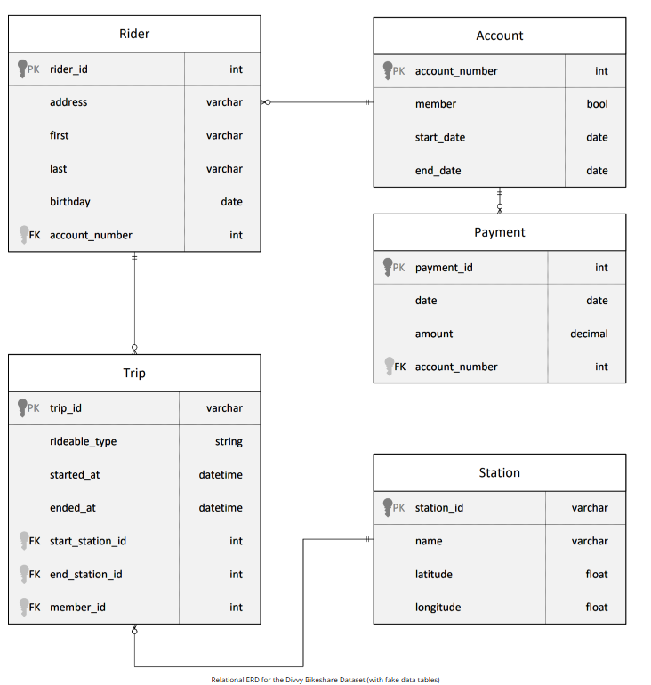
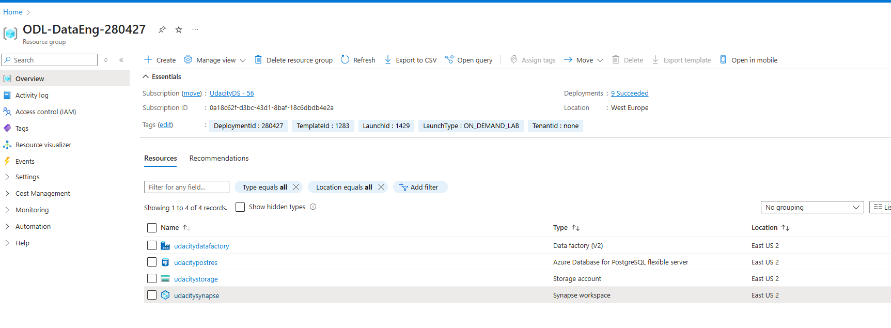
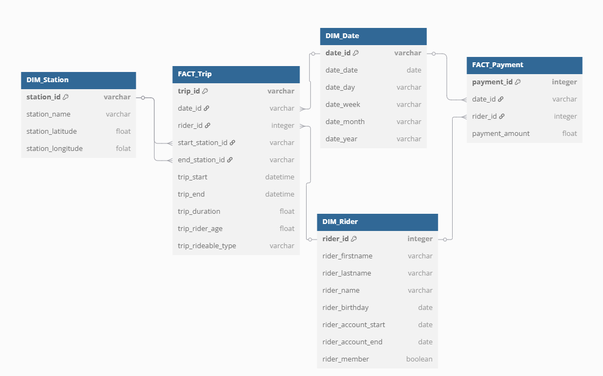
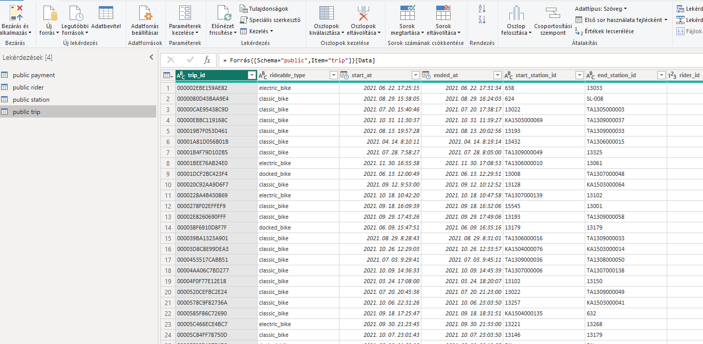
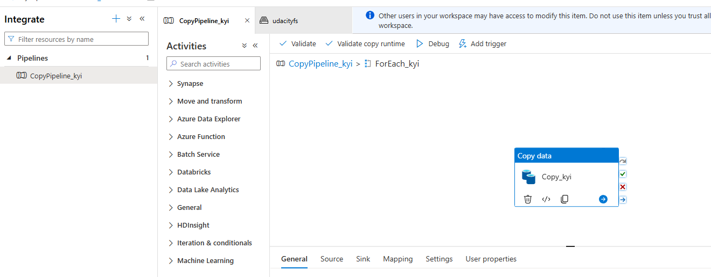
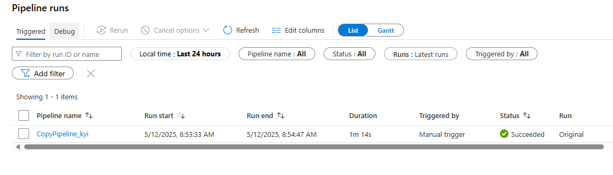
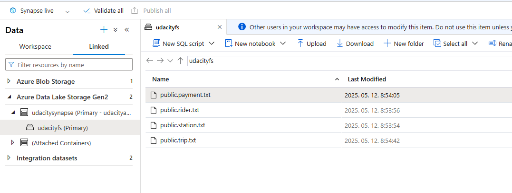
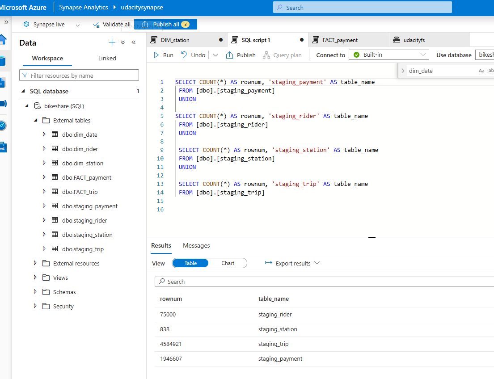
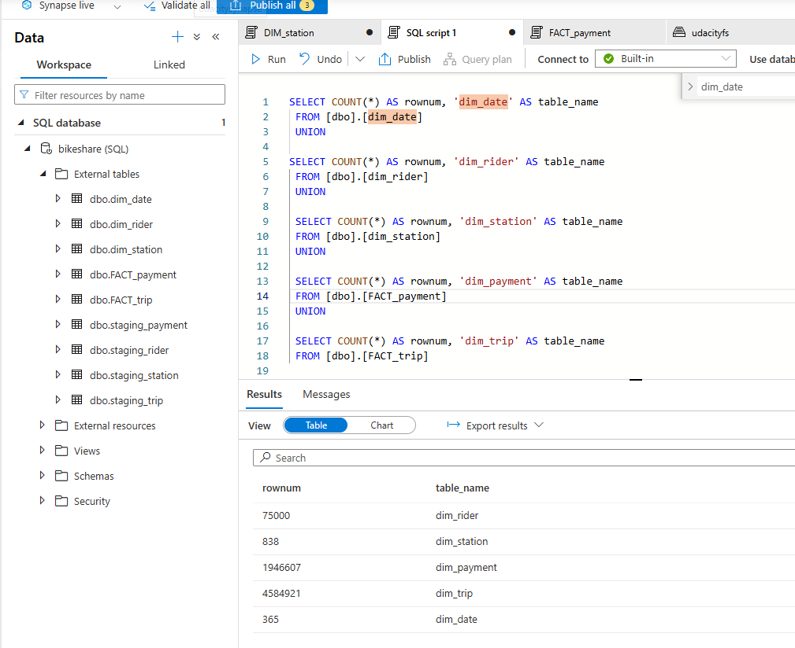

# Building an Azure Data Warehouse for Bike Share Data Analytics

This repository contains my solution for the Udacity Data Engineering on Azure Nanodegree - Building an Azure Data Warehouse for Bike Share Data Analytics projectwork. 

CREATED BY: MIHALY GARAMVOLGYI

## Project Overview 

Divvy is a bike sharing program in Chicago, Illinois USA that allows riders to purchase a pass at a kiosk or use a mobile application to unlock a bike at stations around the city and use the bike for a specified amount of time. The bikes can be returned to the same station or to another station. The City of Chicago makes the anonymized bike trip data publicly available for projects like this where we can analyze the data.

Since the data from Divvy are anonymous, we have created fake rider and account profiles along with fake payment data to go along with the data from Divvy. The dataset looks like this:

 

The goal of this project is to develop a data warehouse solution using Azure Synapse Analytics. 

You will:

* Design a star schema based on the business outcomes listed below;
* Import the data into Synapse;
* Transform the data into the star schema;
* and finally, view the reports from Analytics.

## Task 1: Create your Azure resources

* Create an Azure Database for PostgreSQL.
* Create an Azure Synapse workspace. Note that if you've previously created a Synapse Workspace, you do not need to create a second one specifically for the project.
* Use the built-in serverless SQL pool and database within the Synapse workspace

The below resources were created in Azure lab manually:

 

## Task 2: Design a star schema

You are being provided a relational schema that describes the data as it exists in PostgreSQL. In addition, you have been given a set of business requirements related to the data warehouse. You are being asked to design a star schema using fact and dimension tables.

The below star schema with two fact and three dimension tables were designed:

The link to the ERD diagram:

[Design](https://dbdiagram.io/d/Building-an-Azure-Data-Warehouse-for-Bike-Share-Data-Analytics-681dcad65b2fc4582fe477ac)

## Task 3: Create the data in PostgreSQL

The sample data was loaded to the PostgreSQL using the provided python script to simulate the production of data in the OLTP system. 

The data existence was validated using Power BI

## Task 4: EXTRACT the data from PostgreSQL

In the Azure Synapse workspace, the ingest wizard was used to create a one-time pipeline that ingests the data from PostgreSQL into Azure Blob Storage. This resulted in all four tables being represented as text files in Blob Storage, ready for loading into the data warehouse

## Task 5: LOAD the data into external tables in the data warehouse

Once in Blob storage, the files are shown in the data lake node in the Synapse Workspace. 

From here, the script-generating function was used to load the data from blob storage into external staging tables in the data warehouse previously created using the serverless SQL Pool.

SQL scripts are located in the staging scripts folder

## Task 6: TRANSFORM the data to the star schema using CETAS

SQL scripts were written to transform the data from the staging tables to the final star schema designed.

SQL scripts are located in the transformation scripts folder

## License

[License](LICENSE.txt)
